# metacubexd (Personal Fork)

**Mihomo Dashboard, The Official One, XD**

> **Note:** This is a personal fork of [metacubex/metacubexd](https://github.com/metacubex/metacubexd), customized for self-hosted deployment on my private LAN. Key changes include:
>
> - Server-side proxy for fetching remote subscription configs (bypasses CORS)
> - Optional config persistence to disk via bind mount (Docker deployment)
> - Default binding to `127.0.0.1` for security, configurable via `PRIVATE_IP` env var
>
> If you're looking for the official version, please visit the [upstream repository](https://github.com/metacubex/metacubexd).

[](https://github.com/yewfence/metacubexd/actions)

## ✨ Features

- 📊 Real-time traffic monitoring and statistics
- 🔄 Proxy group management with latency testing
- 📡 Connection tracking and management
- 📋 Rule viewer with search functionality
- 📝 Live log streaming
- 🎨 Beautiful UI with light/dark theme support
- 📱 Fully responsive design for mobile devices
- 🌐 Multi-language support (English, 中文, Русский)
- 🔗 Server-side proxy for fetching remote subscription configs (bypasses CORS)
- 💾 Optional: persist fetched subscription config to disk (Docker deployment)

## 🖼️ Preview

<details>
<summary><b>Desktop Screenshots</b></summary>

|                           Overview                            |                           Proxies                           |
| :-----------------------------------------------------------: | :---------------------------------------------------------: |
| 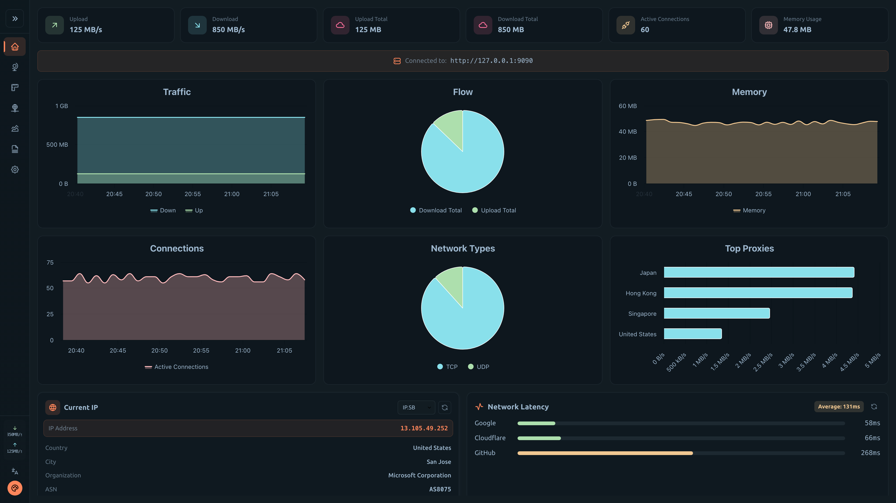 | 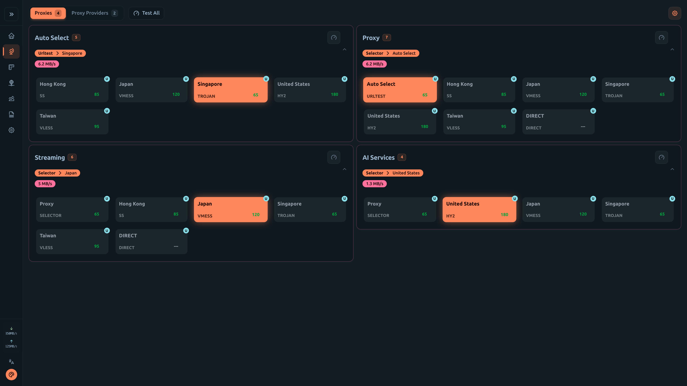 |

|                             Connections                             |                          Rules                          |
| :-----------------------------------------------------------------: | :-----------------------------------------------------: |
| 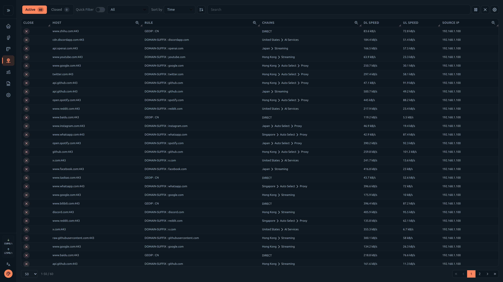 | 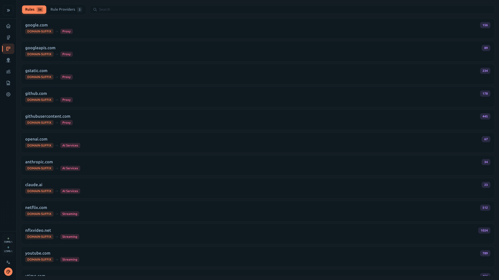 |

|                         Logs                          |                          Config                           |
| :---------------------------------------------------: | :-------------------------------------------------------: |
| 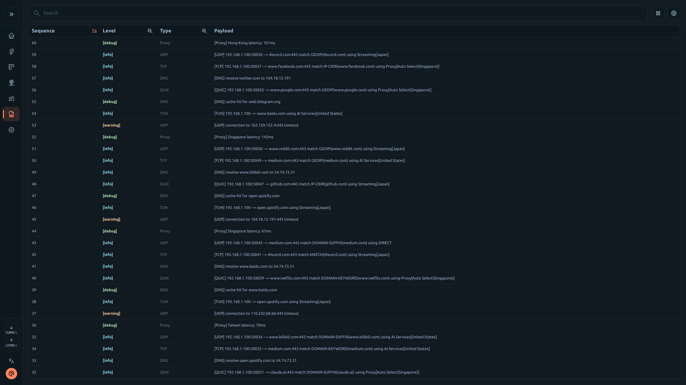 | 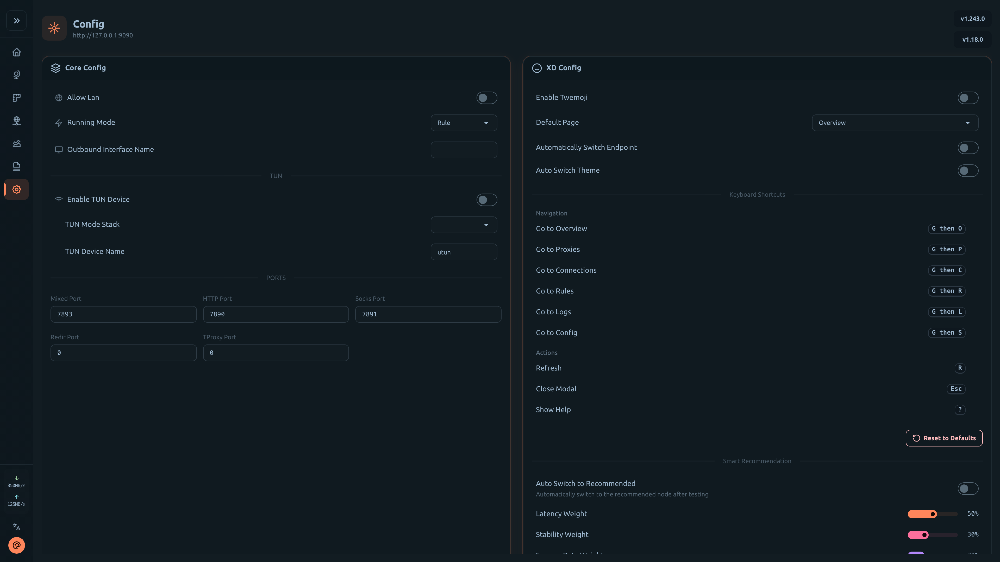 |

</details>

<details>
<summary><b>Mobile Screenshots</b></summary>

|                             Overview                              |                             Proxies                             |                               Connections                               |
| :---------------------------------------------------------------: | :-------------------------------------------------------------: | :---------------------------------------------------------------------: |
| 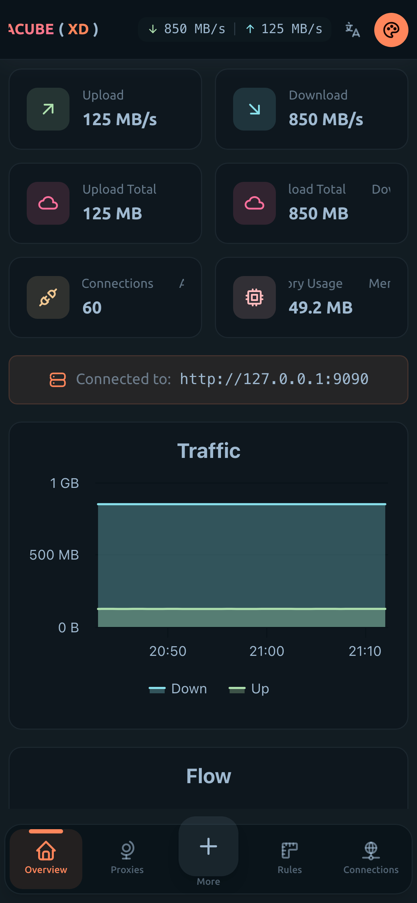 | 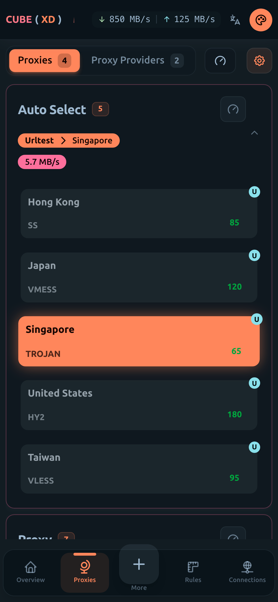 | 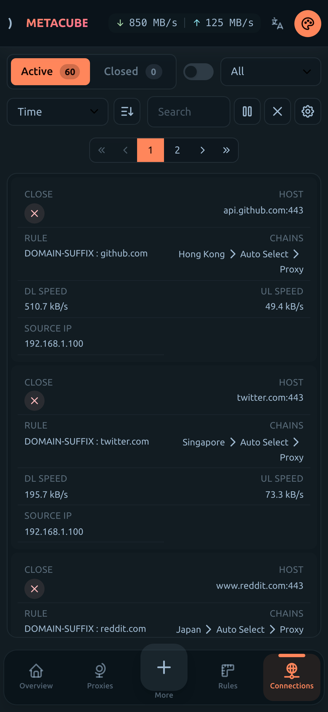 |

|                            Rules                            |                           Logs                            |                            Config                             |
| :---------------------------------------------------------: | :-------------------------------------------------------: | :-----------------------------------------------------------: |
| 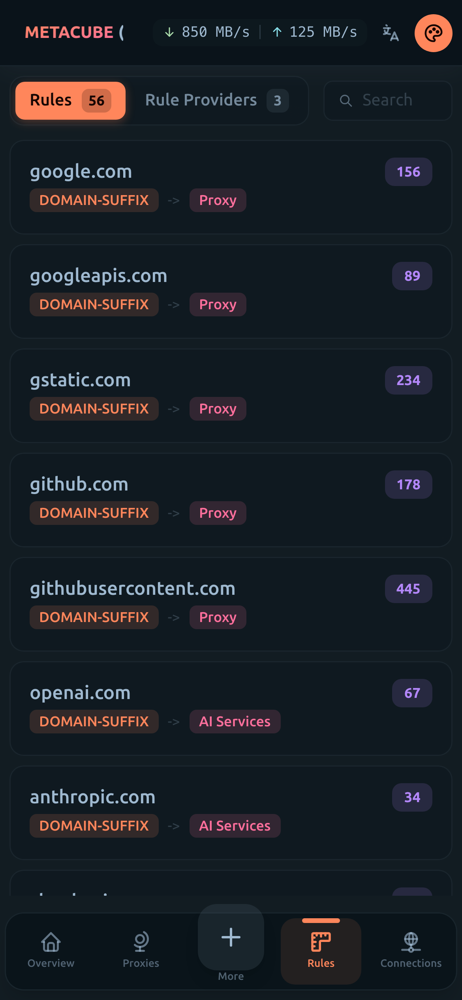 | 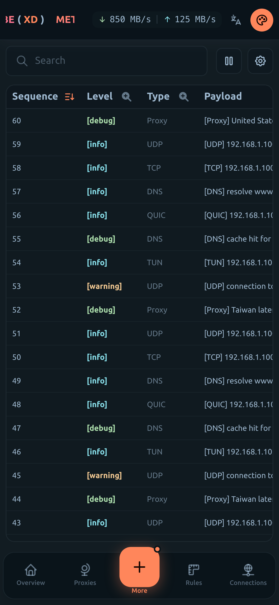 | 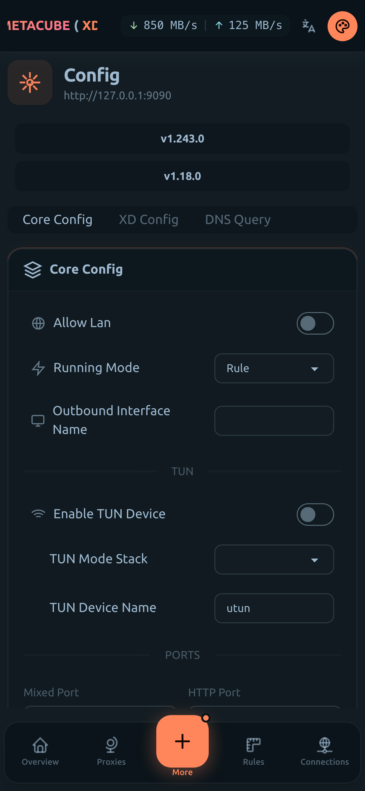 |

</details>

## 🔗 Online Version

If you prefer using the dashboard without Docker, the upstream project provides hosted versions:

- [GitHub Pages](https://metacubex.github.io/metacubexd)
- [Cloudflare Pages](https://metacubexd.pages.dev)

## 🚀 Quick Start

### Prerequisites

Enable external-controller in your mihomo config:

```yaml
external-controller: 0.0.0.0:9090
```

> **Looking for static deployment?** This fork focuses on Docker deployment with server-side proxy features. For pre-built static assets (gh-pages), please use the [upstream repository](https://github.com/metacubex/metacubexd).

### Option 1: Docker

```shell
# Basic usage
docker run -d --restart always -p 80:80 --name metacubexd ghcr.io/yewfence/metacubexd

# With custom default backend URL
docker run -d --restart always -p 80:80 --name metacubexd \
  -e DEFAULT_BACKEND_URL=http://192.168.1.1:9090 \
  ghcr.io/yewfence/metacubexd

# With remote config persistence (optional)
# Requires metacubexd and mihomo on the same machine.
# Mount the mihomo config file into the container via bind mount,
# or set up your own sync mechanism to keep the config in sync.
#
# WARNING: Fetching a remote subscription will overwrite the entire config file,
# which may remove your external-controller setting and break the dashboard connection.
# Use mihomo's -ext-ctl flag to force the external controller address:
#   mihomo -d /path/to/config -ext-ctl 0.0.0.0:9090
docker run -d --restart always -p 80:80 --name metacubexd \
  -e DEFAULT_BACKEND_URL=http://192.168.1.1:9090 \
  -e MIHOMO_CONFIG_PATH=/config/config.yaml \
  -v /path/to/your/config.yaml:/config/config.yaml \
  ghcr.io/yewfence/metacubexd

# Update
docker pull ghcr.io/yewfence/metacubexd && docker restart metacubexd
```

<details>
<summary><b>Docker Compose</b></summary>

```yaml
services:
  metacubexd:
    container_name: metacubexd
    image: ghcr.io/yewfence/metacubexd
    restart: always
    ports:
      - '80:80'
    # environment:
    #   - DEFAULT_BACKEND_URL=http://192.168.1.1:9090

  # Optional: mihomo instance
  mihomo:
    container_name: mihomo
    image: docker.io/metacubex/mihomo:Alpha
    restart: always
    pid: host
    network_mode: host
    cap_add:
      - ALL
    volumes:
      - ./config.yaml:/root/.config/mihomo/config.yaml
      - /dev/net/tun:/dev/net/tun
```

```shell
docker compose up -d

# Update
docker compose pull && docker compose up -d
```

</details>

### Option 2: Build from Source

```shell
# Install dependencies
pnpm install

# Build for static hosting (gh-pages, etc.)
pnpm generate

# Preview
pnpm preview
```

## 🛠️ Development

```shell
# Start dev server
pnpm dev

# Start dev server with mock data
pnpm dev:mock

# Lint & Format
pnpm lint
pnpm format
```

## 📄 License

[MIT](./LICENSE)

## 🙏 Credits

- [Nuxt](https://github.com/nuxt/nuxt) - The Intuitive Vue Framework
- [Vue.js](https://github.com/vuejs/core) - The Progressive JavaScript Framework
- [daisyUI](https://github.com/saadeghi/daisyui) - Tailwind CSS components
- [Tailwind CSS](https://tailwindcss.com) - Utility-first CSS framework
